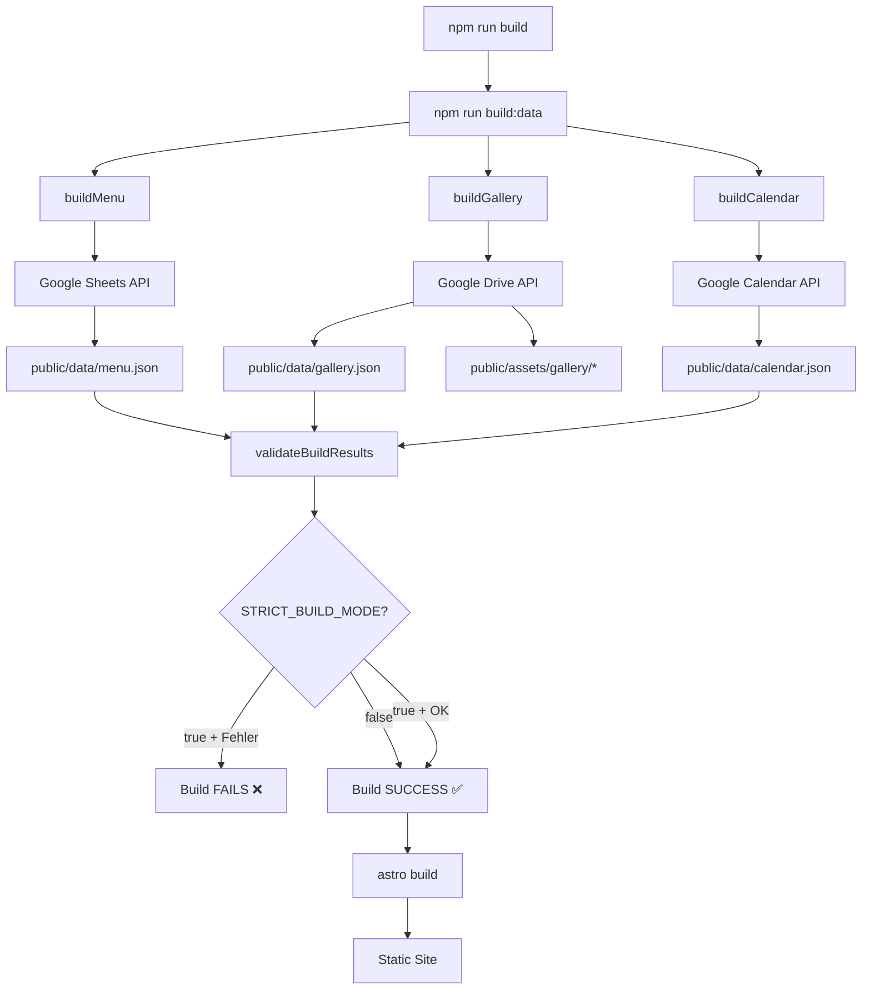
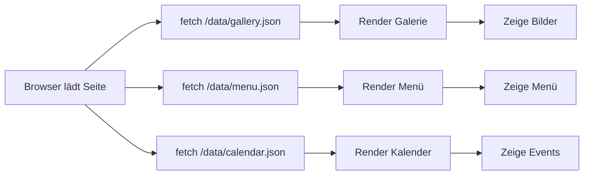

# API-Integration Analyse & Änderungen

## 📊 Übersicht

Die Website verwendet 3 APIs, die beim Build statische JSON-Dateien generieren:
- **Galerie-API** (Google Drive)
- **Menü-API** (Google Sheets)
- **Kalender-API** (Google Calendar)

Da die Website **statisch gehostet** wird, müssen alle Daten zur Build-Zeit geladen werden. Es gibt **keine Runtime-API-Calls** im Browser.

---

## 🔧 Durchgeführte Änderungen

### 1. **Client-Side API-Fallback entfernt** ✅

**Datei:** `src/lib/calendar.ts`

**Problem:** Der Kalender hatte einen Client-Side Fallback zur Google Calendar API, wenn die statischen Daten leer waren. Dies verstößt gegen das statische Hosting-Prinzip.

**Lösung:**
```typescript
// VORHER: Client macht API-Call wenn Daten leer
async function fetchEvents(reference: Date) {
  const staticEvents = await loadStaticEvents();
  if (staticEvents?.length) return staticEvents;

  // ❌ PROBLEM: Browser ruft Google Calendar API auf!
  const apiKey = import.meta.env.PUBLIC_DRIVE_API_KEY;
  // ... fetch Google Calendar API
}

// NACHHER: Nur statische Daten, keine Runtime-API-Calls
async function fetchEvents(reference: Date) {
  const staticEvents = await loadStaticEvents();

  if (!staticEvents) {
    console.warn('Keine Kalender-Daten verfügbar. Build-Prozess muss ausgeführt werden.');
    return [];
  }

  return staticEvents;
}
```

### 2. **Build-Validierung hinzugefügt** ✅

**Datei:** `scripts/build-content.mjs`

**Neu:** `validateBuildResults()` Funktion überprüft nach dem Build:
- Wurden echte API-Daten geladen oder Fallback-Daten verwendet?
- Gibt klare Warnungen und Zusammenfassung aus
- Unterstützt Strict-Mode für Production-Builds

**Build-Output Beispiel:**
```
[content-build] ━━━━━━━━━━━━━━━━━━━━━━━━━━━━━━━━━━━━━━━━
[content-build] Build-Zusammenfassung:
[content-build] ━━━━━━━━━━━━━━━━━━━━━━━━━━━━━━━━━━━━━━━━

[content-build] ✅ Menü: 15 Items geladen
[content-build] ✅ Galerie: 12 Bilder geladen
[content-build] ✅ Kalender: 8 Events geladen
[content-build] ━━━━━━━━━━━━━━━━━━━━━━━━━━━━━━━━━━━━━━━━
```

**Bei Problemen:**
```
[content-build] ⚠️  Menü: Fallback-Daten verwendet (missing-config)
[content-build] ⚠️  Galerie: Verwendet Platzhalter-Bilder (3 Bilder)
[content-build] ⚠️  Kalender: Fallback-Daten verwendet (calendar-fallback)

[content-build] ⚠️  Hinweis: Build verwendet Fallback-Daten.
                Für Production sollten echte API-Daten geladen werden.
[content-build] Setze STRICT_BUILD_MODE=true in der .env,
                um den Build bei Fehlern abzubrechen.
```

### 3. **Strict Build Mode** ✅

**Datei:** `.env.example`

**Neu:** `STRICT_BUILD_MODE` Environment-Variable

```bash
# Build Configuration
# Set to 'true' to fail the build if API data cannot be loaded
STRICT_BUILD_MODE=false
```

**Verwendung:**
```bash
# Development: Verwendet Fallback-Daten bei API-Fehlern
npm run build:data

# Production: Build schlägt fehl, wenn APIs nicht erreichbar
STRICT_BUILD_MODE=true npm run build:data
```

**Strict-Mode Fehlerausgabe:**
```
[content-build] 🚫 STRICT_BUILD_MODE ist aktiviert - Build fehlgeschlagen

[content-build] Behebe die API-Konfiguration in der .env Datei:
[content-build]   - PUBLIC_DRIVE_API_KEY: Google API Key
[content-build]   - PUBLIC_GALLERY_FOLDER_ID: Google Drive Ordner-ID
[content-build]   - MENU_SHEET_ID: Google Sheets ID für Menü
[content-build]   - PUBLIC_CALENDAR_ID: Google Calendar ID

Error: Build validation failed in strict mode
```

---

## 📁 Datenfluss (Aktuell)

### Build-Zeit (CI/CD Pipeline)



### Runtime (Browser)



**Wichtig:** Alle Daten sind statisch! Keine API-Calls im Browser.

---

## 🔑 API-Konfiguration

### Erforderliche Environment-Variablen

Erstelle eine `.env` Datei (kopiere `.env.example`):

```bash
# Google API Key (erforderlich für alle APIs)
PUBLIC_DRIVE_API_KEY=AIzaSy...

# Galerie-Konfiguration
PUBLIC_GALLERY_FOLDER_ID=1ABC123xyz...

# Menü-Konfiguration (wähle eine Option)
MENU_SHEET_ID=1XYZ789abc...
MENU_SHEET_RANGE=A1:Z

# Kalender-Konfiguration
PUBLIC_CALENDAR_ID=abc123@group.calendar.google.com

# Build-Modus (optional)
STRICT_BUILD_MODE=false
```

### Google API Setup

1. **Google Cloud Console:** https://console.cloud.google.com/apis/credentials
2. **APIs aktivieren:**
   - Google Drive API
   - Google Sheets API
   - Google Calendar API
3. **API-Key erstellen** (öffentlicher Key für Read-Only)
4. **Berechtigungen:**
   - Drive-Ordner: "Jeder mit dem Link kann ansehen"
   - Sheets: "Jeder mit dem Link kann ansehen"
   - Calendar: Öffentlicher Kalender oder API-Key hat Zugriff

---

## 📦 Generierte Dateien

### 1. Menü: `public/data/menu.json`

```json
{
  "items": [
    {
      "title": "Signature Burger",
      "price": "11.90",
      "description": "...",
      "unit": "pro Stück",
      "category": "Burger"
    }
  ],
  "source": "sheet-api",
  "fetchedAt": "2025-12-15T12:00:00.000Z"
}
```

**Quellen:**
- `sheet-api` ✅ Erfolgreich von Google Sheets geladen
- `missing-config` ⚠️ API-Konfiguration fehlt
- `sheet-api-error` ❌ API-Fehler

### 2. Galerie: `public/data/gallery.json`

```json
[
  {
    "url": "/assets/gallery/1ABC123.jpg",
    "thumbnail": "/assets/gallery/1ABC123.jpg",
    "alt": "Burger auf rustikalem Brett"
  }
]
```

**Bilder werden heruntergeladen nach:** `public/assets/gallery/`

### 3. Kalender: `public/data/calendar.json`

```json
{
  "events": [
    {
      "id": "event123",
      "title": "Foodtruck @ Stadtfest",
      "location": "Marktplatz München",
      "start": "2025-12-20T10:00:00",
      "end": "2025-12-20T18:00:00"
    }
  ],
  "source": "calendar-api",
  "fetchedAt": "2025-12-15T12:00:00.000Z",
  "timeMin": "2025-12-01T00:00:00.000Z",
  "timeMax": "2026-12-31T23:59:59.999Z"
}
```

**Quellen:**
- `calendar-api` ✅ Erfolgreich geladen
- `calendar-empty` ⚠️ Keine Events im Zeitraum
- `calendar-fallback` ❌ API-Fehler

---

## 🚀 Deployment-Workflow

### Development

```bash
# .env mit Test-Daten oder ohne .env (verwendet Fallbacks)
npm run build:data
npm run dev
```

### Production

```bash
# .env mit echten API-Credentials
STRICT_BUILD_MODE=true npm run build
```

### CI/CD (z.B. Netlify, Vercel)

**Environment Variables konfigurieren:**
```
PUBLIC_DRIVE_API_KEY=...
PUBLIC_GALLERY_FOLDER_ID=...
MENU_SHEET_ID=...
PUBLIC_CALENDAR_ID=...
STRICT_BUILD_MODE=true
```

**Build-Command:**
```bash
npm run build
```

Dies führt automatisch aus:
1. `npm run build:data` - Lädt API-Daten
2. `validateBuildResults()` - Prüft Daten
3. `astro build` - Generiert statische Site

**Bei Fehler:**
- Build schlägt fehl (Exit Code 1)
- Deployment wird verhindert
- Log zeigt fehlende Konfiguration

---

## 🔍 Troubleshooting

### Problem: Build verwendet Fallback-Daten

**Symptom:**
```
⚠️  Menü: Fallback-Daten verwendet (missing-config)
```

**Lösung:**
1. Prüfe `.env` Datei existiert
2. Prüfe alle erforderlichen Variablen sind gesetzt
3. Prüfe API-Keys sind gültig
4. Prüfe Berechtigungen (Drive/Sheets/Calendar öffentlich)

### Problem: Galerie zeigt Unsplash-Bilder

**Symptom:**
```
⚠️  Galerie: Verwendet Platzhalter-Bilder (3 Bilder)
```

**Lösung:**
1. `PUBLIC_DRIVE_API_KEY` setzen
2. `PUBLIC_GALLERY_FOLDER_ID` setzen
3. Drive-Ordner auf "Jeder mit Link" setzen
4. `npm run build:data` erneut ausführen

### Problem: Kalender leer

**Symptom:**
```
⚠️  Kalender: Keine Events im Zeitraum gefunden
```

**Ursachen:**
- Keine Events im Zeitraum (nächste 12 Monate)
- Kalender nicht öffentlich
- API-Key hat keinen Zugriff

**Lösung:**
1. Events im Kalender erstellen
2. Kalender öffentlich machen
3. API-Key Berechtigungen prüfen

---

## ✅ Vorteile der neuen Lösung

1. **Vollständig statisch** - Keine Runtime-API-Calls
2. **Bessere Fehlerbehandlung** - Klare Fehlermeldungen
3. **Build-Validierung** - Warnt bei Fallback-Daten
4. **Strict-Mode** - Production-Builds scheitern bei Fehlern
5. **Transparenz** - Build-Summary zeigt Datenquellen
6. **Sicherheit** - Keine API-Keys im Browser
7. **Performance** - Alle Daten vorgeladen
8. **Offline-fähig** - Funktioniert ohne API-Zugriff

---

## 📝 Weitere Empfehlungen

### 1. CI/CD Integration

Füge zu deiner CI/CD-Pipeline hinzu:

```yaml
# .github/workflows/deploy.yml
env:
  STRICT_BUILD_MODE: true
  PUBLIC_DRIVE_API_KEY: ${{ secrets.GOOGLE_API_KEY }}
  PUBLIC_GALLERY_FOLDER_ID: ${{ secrets.GALLERY_FOLDER_ID }}
  MENU_SHEET_ID: ${{ secrets.MENU_SHEET_ID }}
  PUBLIC_CALENDAR_ID: ${{ secrets.CALENDAR_ID }}
```

### 2. Build-Cache

Erwäge, die generierten JSON-Dateien zu cachen:
- Reduziert API-Calls
- Schnellere Builds
- Fallback bei API-Ausfällen

### 3. Data-Refresh

Für automatische Daten-Updates:
- Scheduled Builds (z.B. täglich)
- Webhook bei Änderungen (Google Apps Script)
- Manueller Deploy-Button

### 4. Monitoring

Überwache Build-Success-Rate:
- Log Build-Warnungen
- Alert bei STRICT_MODE Fehlern
- Track Data-Source Metriken

---

**Erstellt:** 2025-12-15
**Autor:** Claude (Analyse & Implementierung)
